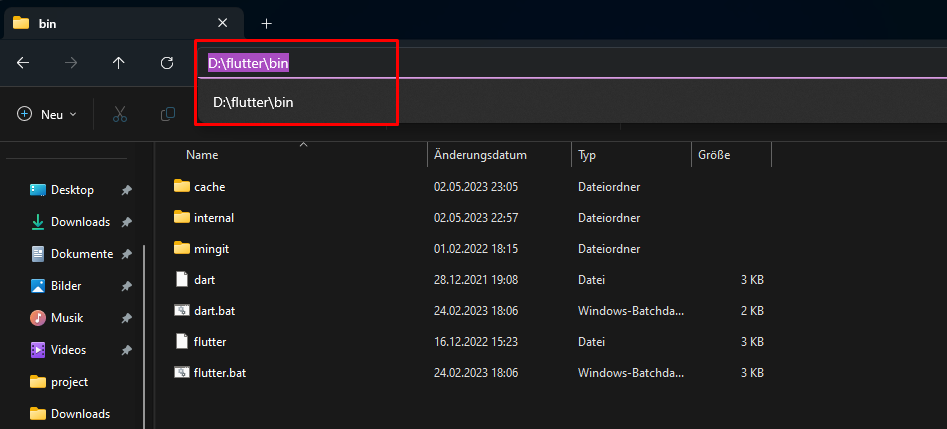
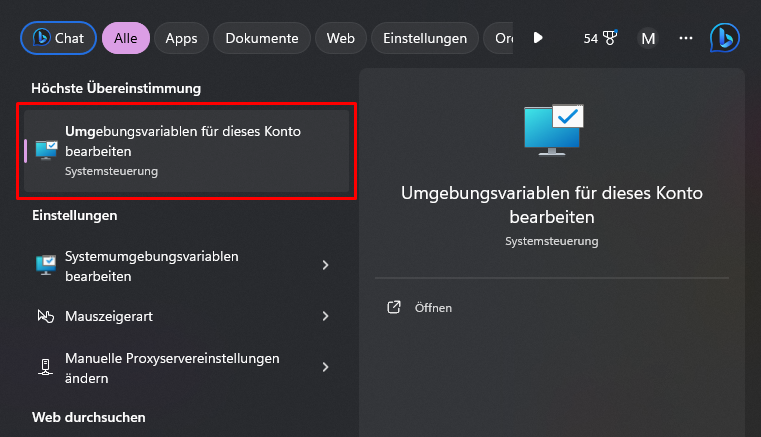
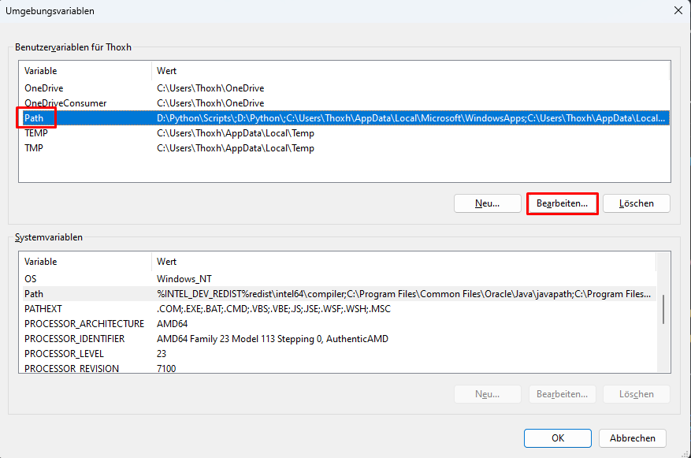
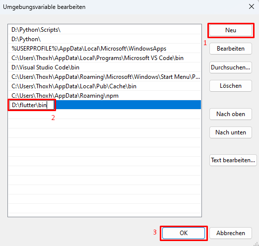
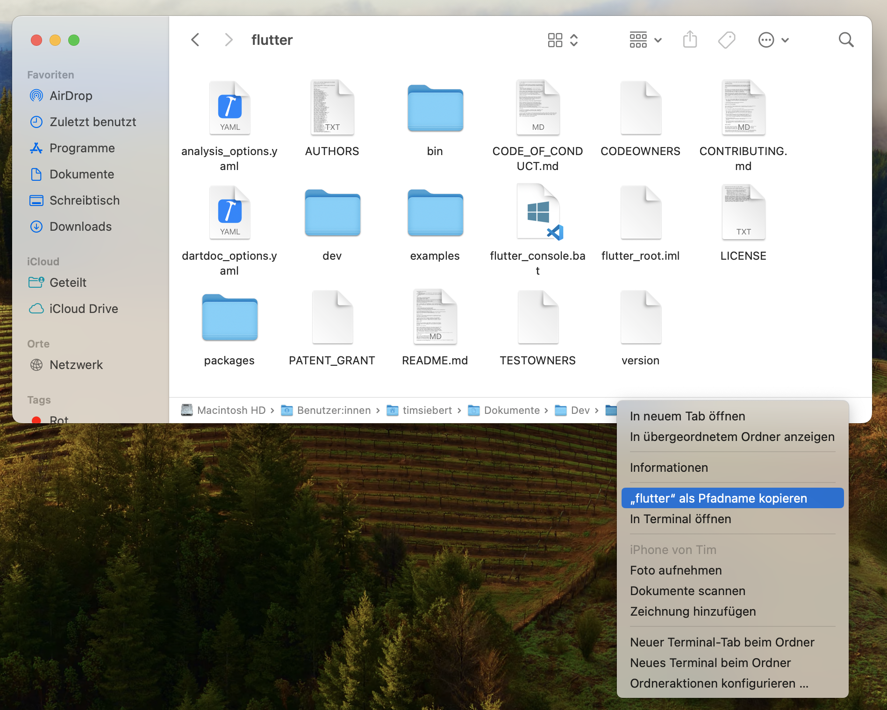
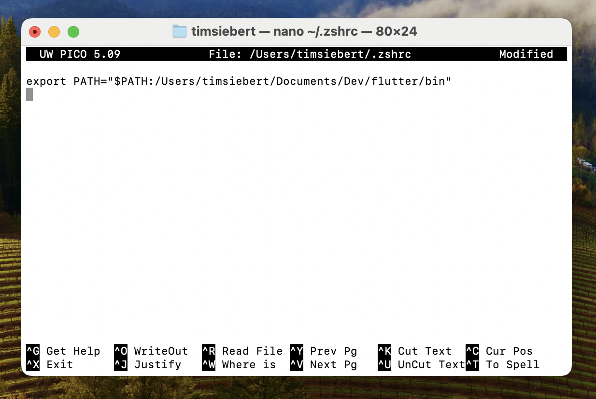

# Installationsguide — Flutter

> Folgend finden Sie eine vereinfachte Anleitung zur Installation von Flutter. Dies ist ein Ausschnitt aus der [offizielen Dokumentation](https://docs.flutter.dev/get-started/install) zur Installation von Flutter.

## Voraussetzung: Visual Studio Code installieren
> Bitte installieren Sie neben Flutter ebenfalls [Visual Studio Code](https://code.visualstudio.com) und die notwendige [Flutter Extension](https://marketplace.visualstudio.com/items?itemName=Dart-Code.flutter).

## Für Windows-Nutzer

### 1. Download Flutter SDK
Das Flutter SDK ist das Herzstück für die Entwicklung von Apps für zahlreiche Plattformen und das Web. Laden Sie es von [hier](https://storage.googleapis.com/flutter_infra_release/releases/stable/windows/flutter_windows_3.16.2-stable.zip) herunter.

### 2. Datei entpacken und verschieben
Nach dem Herunterladen finden Sie eine `.zip`-Datei. Rechtsklicken Sie darauf und wählen Sie 'Alle extrahieren', um den Inhalt zu entpacken. Verschieben Sie dann den `flutter`-Ordner an einen Speicherort Ihrer Wahl, zum Beispiel `D:\flutter\bin`.

> *Hinweis: Vermeiden Sie spezielle Zeichen oder Leerzeichen im Pfad und legen Sie den Ordner nicht direkt in `C:\Program Files\` ab.*

### 3. Flutter zum PATH hinzufügen
Damit Sie die Flutter-Befehle in der Kommandozeile (CMD) global nutzen können, fügen Sie den Pfad zum `flutter\bin`-Ordner zu Ihren Umgebungsvariablen hinzu.

1. **Pfad kopieren** —
   Navigieren Sie zum eben verschobenen `flutter`-Ordner und gehen sie weiterhin in den enthaltenen `\bin`-Ordner und kopieren Sie den Pfad.
   

2. **Zu Umgebungsvariablen navigieren** —
   Über die Windows-Suchleiste zu 'Umgebungsvariablen für dieses Konto bearbeiten'.
   

3. **Pfad zu den Umgebungsvariablen hinzufügen** —
   Fügen Sie den kopierten Pfad zu den Umgebungsvariablen hinzu wie in den folgenden Abbildungen gezeigt. Sofern die `Path`-Variable nicht bereits existiert, erstellen Sie diese.
   
   

4. **Überprüfen** —
   Starten Sie die Konsole (neu) und überprüfen Sie die Installation mit `flutter --version`.

> Bei Problemen wenden Sie sich bitte rechtzeitig per E-Mail an `siebertt@th-brandenburg.de`.

## Für Mac-Nutzer

### 1. Download Flutter SDK
Wählen Sie je nach Ihrem Mac-Typ die passende Version des Flutter SDKs aus: 
- **Intel-Chips**: [Download](https://storage.googleapis.com/flutter_infra_release/releases/stable/macos/flutter_macos_3.16.2-stable.zip)
- **Apple M-Chips**: [Download](https://storage.googleapis.com/flutter_infra_release/releases/stable/macos/flutter_macos_arm64_3.16.2-stable.zip)

Die Download-Datei sollte sich automatisch entpacken.

### 2. Flutter verschieben
Verschieben Sie den `flutter`-Ordner in einen Ordner Ihrer Wahl, wie zum Beispiel `/Users/timsiebert/Documents/Dev/flutter`.

### 3. Flutter zum PATH hinzufügen
Um den `flutter`-Befehl jederzeit im Terminal ausführen zu können, muss der Pfad zum Flutter-Ordner zum PATH hinzugefügt werden.

1. **Pfad herausfinden** — 
   Öffnen Sie den Flutter-Ordner im Finder, drücken Sie `Command + Option + P` *(Symbolische Pfadanzeige anzeigen)* und kopieren Sie den angezeigten Pfad, wie in der Abbildung gezeigt durch einen Rechtsklick unten auf `flutter`.
   

2. **Terminal öffnen** —
   Öffnen Sie das Terminal über Spotlight/Suche - *(`Command + Space` und nach Terminal suchen oder über die Linse in der oberen Mac-Leiste)* .

3. **PATH öffnen** —
   Legen Sie eine neue PATH-Datei mit `nano ~/.zshrc` an, falls noch nicht vorhanden, und fügen Sie `export PATH="$PATH:[PATH_TO_FLUTTER_DIRECTORY]/flutter/bin"` ein. Hier benötigen Sie den kopierten Pfad aus Schritt 1. *(Der Mauszeiger funktioniert im Terminal nicht, daher mit den Pfeiltasten navigieren und Pfad ersetzen)* Vergleichen Sie ihre Eingabe mit dem folgenden Screenshot.
   

4. **PATH speichern** — 
   Speichern Sie die Änderungen mit `Control + X`, bestätigen Sie mit `Y` und drücken Sie `Enter`.

5. **Überprüfen** — 
   Starten Sie das Terminal neu und überprüfen Sie die Installation mit `flutter --version`.

> Bei Problemen wenden Sie sich bitte rechtzeitig per E-Mail an `siebertt@th-brandenburg.de`.