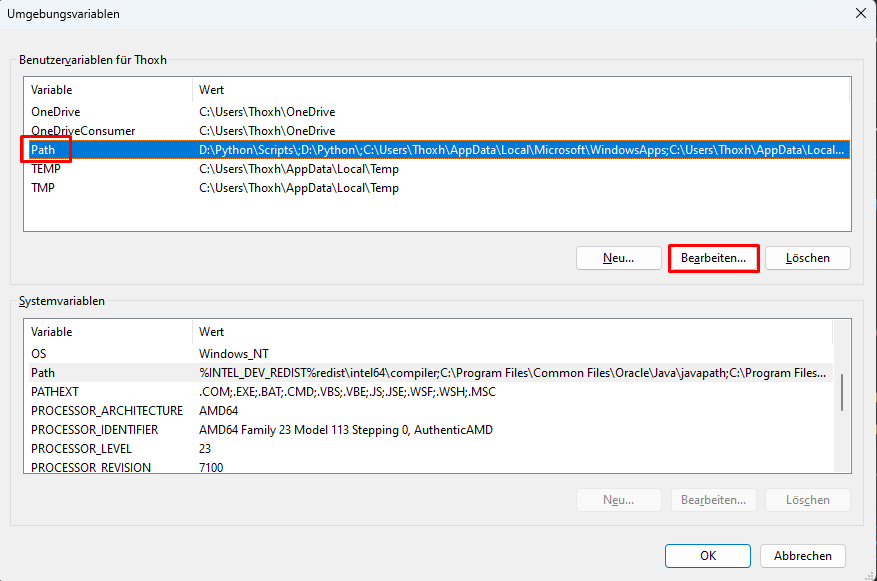

# Installationsguide — Flutter
## Windows
### 1. Download Flutter SDK
> [Download](https://storage.googleapis.com/flutter_infra_release/releases/stable/windows/flutter_windows_3.16.2-stable.zip)

### 2. Datei entpacken und verschieben
> Entpacke das geladene .zip-Verzeichnis und verschiebe den Ordner an einen geeigneten Ort. Ich habe es zum Beispiel unter folgendem Pfad: `D:\flutter\bin`

*Der Pfad sollte keine speziellen Zeichen oder Leerzeichen beinhalten. Außerdem sollte der Ordner nicht direkt in C:\Program Files\ gelegt werden.*

### 3. Flutter zum PATH hinzufügen
> Der Flutterordner muss zu den Umgebungsvariablen von Windows hinzugefügt werden, um global Zugriff auf den Konsolenbefehl `flutter` zu bekommen. 

1. **Pfad kopieren** —
Gehe in den eben verschobenen Flutterordner und navigiere in den enthaltenen `\bin` Ordner. Kopiere nun den Pfad zu diesem Ordner.\
\

2. **Zu Umgebungsvariablen navigieren** —
Navigiere durch die Windows-Suchbar zu `Umgebungsvariablen für dieses Konto bearbeiten`\
\

3. **Pfad zu den Umgebungsvariablen hinzufügen** —
Wähle nun `Path` aus oder erstelle diese Variable, sofern sie nicht bereits vorhanden ist. Bearbeite den Wert der Variable durch den Button `Bearbeiten...`. \
\

Erstelle einen neuen Wert durch den Button `Neu` und setze den eben kopierten Pfad von deinem `...\flutter\bin` Ordner ein. Klicke anschließend `OK`\
\

## Mac
### 1. Download Flutter SDK
> **Intel-Chips**: [Download](https://storage.googleapis.com/flutter_infra_release/releases/stable/macos/flutter_macos_3.16.2-stable.zip) —
 **Apple M-Chips**: [Download](https://storage.googleapis.com/flutter_infra_release/releases/stable/macos/flutter_macos_arm64_3.16.2-stable.zip)

*Download-Datei sollte sich automatisch entpacken.*

### 2. Flutter verschieben

> Der Flutterordner sollte in einen eigenen Ordner verschoben werden. Ich habe es zum Beispiel unter folgendem Pfad: `/Users/timsiebert/Documents/Dev/flutter`

### 3. Flutter zum PATH hinzufügen

> Damit man jederzeit und global den Konsolenbefehl `flutter` ausführen kann, ist es zwingend notwending den Pfad zum Flutterordner zum **PATH** hinzuzufügen

1. **Pfad herausfinden** — 
Gehe in den Flutterordner mittels des Finders und drücke gleichzeitig `Command + Option + P`. Nun sollte der Pfad symbolisch im Finder angezeigt werden. Linksklicke auf das letzte Element `flutter` und wähle `"flutter" als Pfadname kopieren` aus.\
\

2. **Terminal öffnen** —
Terminal über Spotlight / Suche öffnen. Die Suchleiste lässt sich durch das Klicken auf die Linse oben, rechts auf dem Bildschirm öffnen oder durch `Command + Space`. Anschließend `Terminal`eingaben, um das Terminal zu öffnen.

3. **PATH öffnen** —
Durch den Befehl `nano ~/.zshrc` eine neue PATH-Datei anlegen, sofern nicht bereits vorhanden. Folgendes eintragen: `export PATH=”$PATH:[PATH_TO_FLUTTER_DIRECTORY]/flutter/bin”` Der Mauszeiger funktioniert im Terminal nicht, daher mit den Pfeiltasten navigieren und Pfad ersetzen.\
\

4. **PATH speichern** — 
Weiterhin in der neuen Datei: `Control + X` zum Speichern, `Y` zum bestätigen und `Enter` zum finalen Speichern.

5. **Überprüfen** — Terminal neustarten (schließen und wieder öffnen) und durch `flutter --version` überprüfen ob die Installation erfolgreich war.